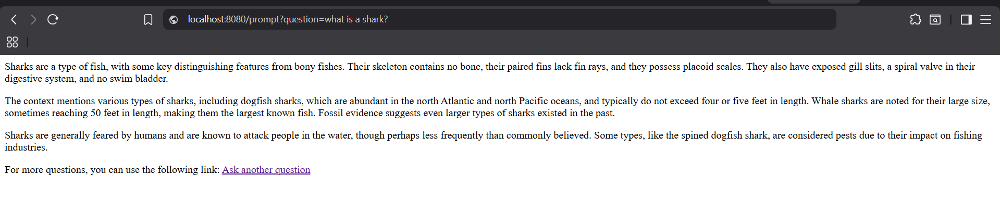
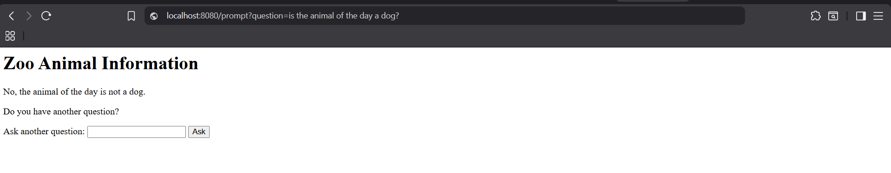
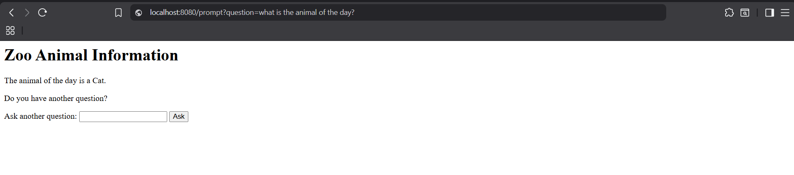

# SpringAI

In this repository, I experiment with the [SpringAI framework](https://spring.io/projects/spring-ai) for agentic applications.

My idea was to make an application about a chatbot for a Zoo. The user can ask questions, based on a embedded [document](https://github.com/CinquilCinquil/SpringAI/blob/main/data/ANIMAL_BIOLOGY.pdf), and guess the "Animal of The Day", through the usage of tools (see the [MCP repository](https://github.com/CinquilCinquil/SpringAI_MCP)).

## Requirements to run

A vector database is needed. I used docker with this [image](https://hub.docker.com/r/pgvector/pgvector)